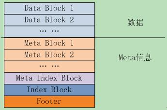

## 参考资料
[leveldb源码分析系列](http://blog.csdn.net/sparkliang/article/category/1342001)

##  
leveldb 不提供网络相关部分，不是一个server，是一个单机的存储lib， lib中会采用多线程技术

## util/ arena.h arena.cc
class Arena ， 简单的内存池

## db/  skiplist.h
class SkipList 跳表，节点有序，查找lgN复杂度，相对于平衡二茶树，红黑树实现简单


## db/  memtable.h memtable.cc 

class MemTable 类, 内存表结构，
   用skip_list结构存储key-value（按key顺序排列) 
   用内存池，新增的key-value 从内存池分配空间
   提供add接口，接口带sequenceNum，也就是版本号；用于新增key-value, 删除key(leveldb删除key 直接新插入这个key，标记为删除)
   提供get接口，查找某个key

   InteralKey 内部key的组成   |UserKey(string)|SequnceNum|valueType| 
   这样UserKey之间有序， 同一个UserKey 的不同版本号 有序

class MemTableIterator 针对MemTable 提供迭代器
    MemTableIterator 继承于 Iterator, 内部用SkipList的接口

## include/leveldb  iterator.h 

class Iterator 纯虚类，指定接口

##  include/leveldb/table.h   db/table.h

class Table

A Table is a sorted map from strings to strings.  Tables are immutable and persistent.  A Table may be safely accessed from
multiple threads without external synchronization.          


## log文件
1. levelDb 更新数据时 采用先写log（WL 预写log方式) , 然后更新内存memtable， 这种技术很多系统种采用

1)log顺序写 append

2)进程异常时,内存数据丢失时， 可以从log种恢复

2. PS: leveldb 可以指定写log的方式 async下写Log文件不会立即刷到磁盘，由OS负责. sync方式下，写LOG后调用sync接口把数据刷到磁盘

3. source file: log_writer.h log_writer.cc log_reader.h log_reader.cc  log_format.h

4. block_size 32K  1条Log可以占用多个block , 一个block里面也可以包含多个Log


## SSTable 文件
### doc/table_format.txt 描述了文件的逻辑结构



文件中的key-value对，按 key有序的，被划分存储在data Block里面

data Block 之后是meta Block , 格式同data block，里面存储的时filter 信息，比如bloom过滤器

metaIndex Block 是对meta Block的索引，

index Block 是data Block的索引， 

footer : 固定大小 metaIndex_handler, index_handler 


### block 的逻辑结构   

代码： block.h , block.cc 

block 里面存储的key-value队，key直接时有序的，为了节约存储空间，队key存储采用的是前缀压缩
为了兼顾查找效率，每隔K个key，leveldb 就不使用前缀压缩，而是存储整个key,也叫做重启节点


block 在结尾存储所有的重启节点

block 结尾的格式：   

restarts : uint32[num_restarts]

num_restarts : uint32 // 重启点个数

class Block 提供迭代器访问block里面的key-value数据

代码： block_builder.h block_builder.cc

构造block, 从class BlockBuilder::Add() 里面可以看出来 key-value 的key 的share部分是依赖 他前面一个key-value 的key


### footer

talbe/foramt.h table/foramt.cc

class Footer


### bloom filter 

meta Block 里面存储的是filter信息。

代码:  filter_block.h    filter_block.cc   

代码:  include/leveldb/filter_police.h

class FilterPolicy     过滤器策略 虚函数，虚基类

代码:  util/bloom.cc    blooom过滤器

class BloomFilterPolicy: public FliterPolicy
代码比较简单，bloom过滤器的文章网上也有很多介绍。
大概思路是
1、对于一个key，通过计算多个hash值，hash取模后在对应的数组bit位置标记1.
1、如何判断一个key是否存在：如果多个hash值计算的结果都在数组中，则可能存在，否在肯定不存在
3、每个key 要计算几个hash值(占用几个bit)，这里可以找其他文章学习。

## DB 打开 流程
```
Status DB::Open(const Options& options,
                      const std::string& name,
                     DB** dbptr);

```


